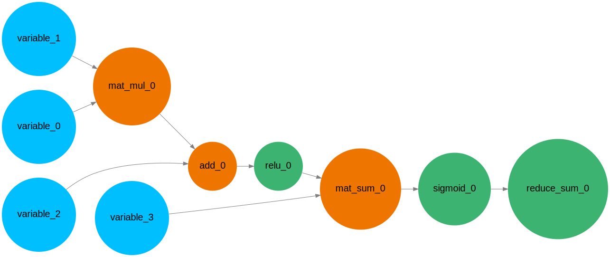

# Auto-Diff-Graph-CPP
This repo aims to help everyone grasp a deeper understanding of tensor operations and automatic differentiation mechanisms in TensorFlow, PyTorch etc.

## Tensor Module
This part implements a standalone module for creating and manipulating multidimentional array like Numpy. The operations are based on CPU with BLAS.

Some of the methods implemented:
- dot, multiply, add: do some basic algorithm functions for matrices/tensors
- reshape: change the shape of the tensor
- transpose: switch two axes of the tensor
- take: slice tensor along an axis
- sum: sum the values along an axis
- fill_diag: fill the diagonal entries with a vector
- map: accept a lambda function and transforms the value of each entry
- kron: do the matrix kronecker product, used in the backprop of matrix multiplication

We are trying to learn BLAS and make full use of its extreme performance. Any advice would be very appreciated! :)

## Graph Module
This part contains all elements with regard to building an automatic differential graph. There are different types of nodes on the graph:
- Node: base class for all nodes; it is abstract and no backward or forward is defined
- Variable: leaf nodes controlling the user's input
- Ops: algorithmic operations between different nodes
- Functional: activation functions and loss functions

### Graph Forward and Backward
Each node of the graph will have to implement the logics of `do_forward()` and `do_backward(Node* parent_ptr)`, the first one computes its forward value and the other computes the nodes' jacobian matrix with regard to one of its parent nodes.

A code snippet about how to build the graph:

```cpp
  Graph *graph = Graph::get_instanceof_global_graph();

  Variable x = Variable({2, 2});         # variable is placeholder, input shape [2, 2]
  Variable labels = Variable({2, 2}); 

  tensor::Tensor<double> value_x = tensor::Tensor<double>({2, 2}, {1, 2, 3, 4});
  tensor::Tensor<double> value_labels = tensor::Tensor<double>({2, 2}, {1, 0, 1, 0});

  x.assign_value(value_x);
  labels.assign_value(value_labels);

  tensor::Tensor<double> weight = tensor::Tensor<double>({2, 2}, {0.1, -0.1, 0.1, -0.1});
  tensor::Tensor<double> bias = tensor::Tensor<double>({1}, 0.02);

  // build graph
  layer::Dense dense_layer(2, 2);
  dense_layer.assign_weight(weight);
  dense_layer.assign_bias(bias);

  auto target = functional::cross_entropy_with_softmax(dense_layer(x), labels);

  // forward
  graph->zero_grad();
  target.forward();

  // backward
  graph->backward(target);
```

### Graph Visualization
We are using [Graphviz](https://graphviz.org/about/) to visualize the computational graph. Call `graph->visualize("file.svg")` to convert the graph into a DOT image and saves as SVG file.

Use `-DUSE_GRAPHVIZ=OFF` in cmake command line to turn off using graphviz.

Example output:



## Dependency
Here are some software and packages used in this project:

> cblas
>
> graphviz
>
> cgraph
>
> googletest
